# Introduction to OpenShift

In this lab you will deploy a containerized application on OpenShift using three approaches:
the **imperative** way (CLI commands), the **declarative** way (YAML manifests), and the **web console** (graphical interface).
You will also expose the app via a secure HTTPS Route.

---

## Prerequisites

Make sure you are in the lab directory before running any command:

```bash
cd day-2/01-introduction-to-openshift/lab/basic-deployment/deployment/
```

---

## 1. Log in to the cluster

Open the OpenShift Console in your browser:

```
https://<openshift-cluster-domain>
```

Retrieve your login token from the console:

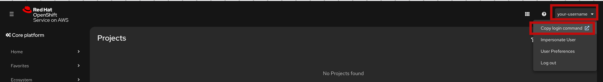

Then log in from the terminal using that token:

```bash
oc login --token=<your-api-token> --server=https://<server.cluster.domain>:443
```

---

## 2. Create your project

Each user gets their own isolated namespace. Replace `<username>` with your assigned username (e.g. `<username>`):

```bash
oc new-project <username>-demo-app
```

> 💡 All subsequent commands use `-n <username>-demo-app` to target your namespace.

---

## 3. Deploy the application

### Option A — Imperative (step by step)

Use this approach to understand what each resource does individually.

```bash
# 1. Create a Deployment and Service from the container image
oc new-app quay.io/openshift/origin-hello-openshift --name=hello-openshift -n <username>-demo-app

# 2. Wait for the pod to be Running
oc get pods -n <username>-demo-app

# 3. Expose the Service as an HTTP Route
oc expose service hello-openshift -n <username>-demo-app

# 4. Enable HTTPS and redirect HTTP → HTTPS
oc patch route hello-openshift -n <username>-demo-app \
  --type=merge \
  -p '{"spec":{"tls":{"termination":"edge","insecureEdgeTerminationPolicy":"Redirect"}}}'

# 5. Verify the Service and Route were created
oc get svc,route -n <username>-demo-app

# 6. (Optional) Inspect the Deployment details
oc describe deployment/hello-openshift -n <username>-demo-app
```

**Clean up** when you are done with this section:

```bash
oc delete route,service,deployment hello-openshift -n <username>-demo-app
```

---

### Option B — Declarative (recommended)

Use this approach in real projects. All resources are defined in YAML files and applied at once.

The following files are already provided in the `deployment/` directory:

| File | What it creates |
|---|---|
| `hello-openshift.yaml` | `Deployment` — runs 2 replicas of the app |
| `service-route.yaml` | `Service` + `Route` with HTTPS edge termination |

```bash
# Apply all manifests in the current directory
oc apply -f . -n <username>-demo-app

# Verify everything is running
oc get pods,svc,route -n <username>-demo-app
```

**Clean up** when you are done:

```bash
oc delete -f . -n <username>-demo-app
```

---


### Option C — Web Console

Use this approach to explore OpenShift visually without writing any commands.

---

**Step 1 — Create a project**

In the top navigation bar, click on the project dropdown and select **Create Project**.

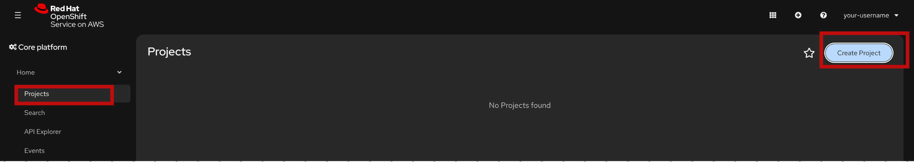

Fill in the project name as `<username>-demo-app` and click **Create**.

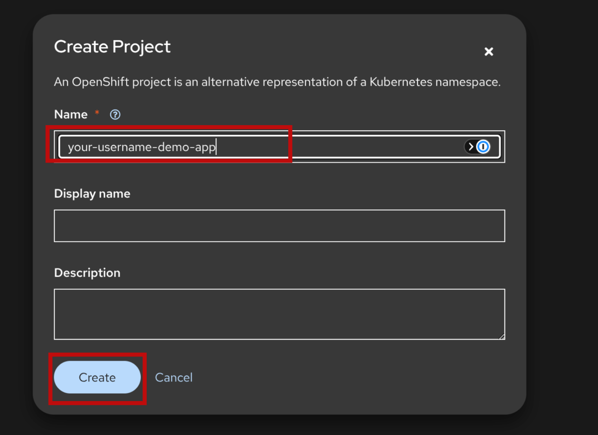

---

**Step 2 — Create a Deployment**

Navigate to **Workloads → Deployments** and click **Create Deployment**.

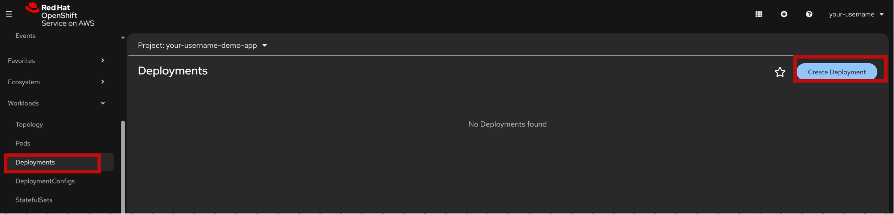

Fill in the form with the following values:
- **Name:** `hello-openshift`
- **Image:** `quay.io/openshift/origin-hello-openshift:latest`
- **Replicas:** `2`
- **Container port:** `8080`

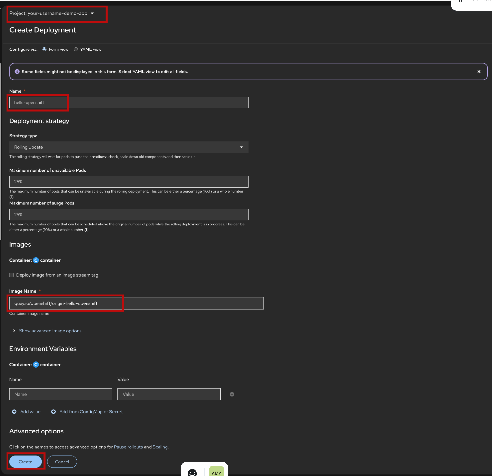

---

**Step 3 — Verify the Deployment**

Once created, confirm that the pods reach the **Running** state before continuing.

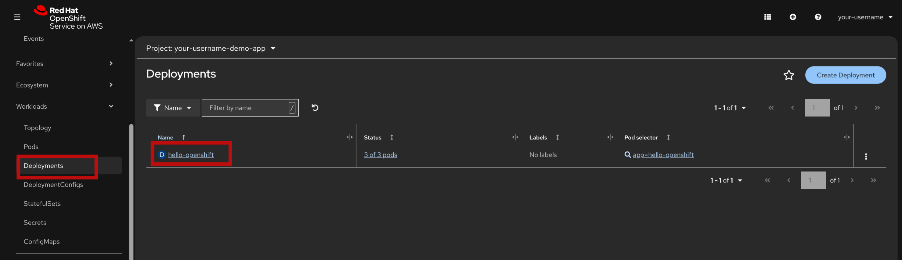

---

**Step 4 — Create a Service**

Navigate to **Networking → Services** and click **Create Service**.

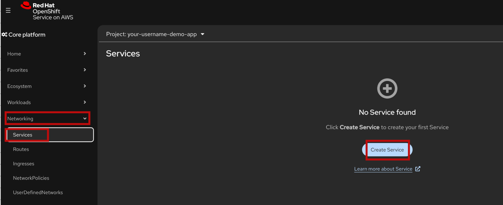

Fill in the form with the following values:
- **Name:** `hello-openshift`
- **Selector:** `app=hello-openshift`
- **Port:** `80`
- **Target port:** `8080`

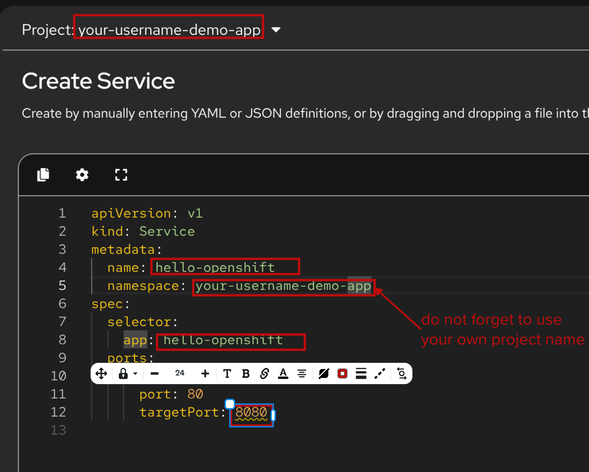

---

**Step 5 — Create a Route**

Navigate to **Networking → Routes** and click **Create Route**.

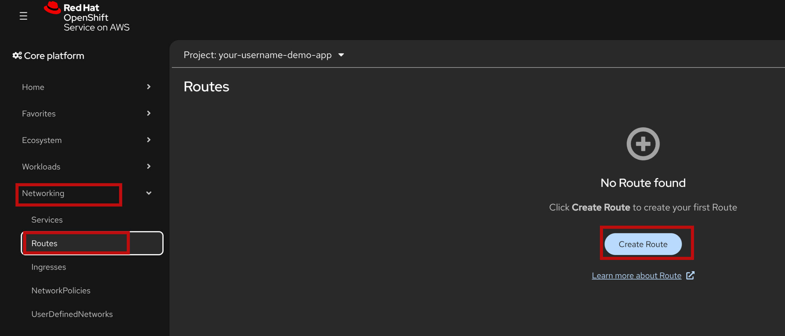

Fill in the form with the following values:
- **Name:** `hello-openshift`
- **Service:** `hello-openshift`
- **Target port:** `8080`
- **Security:** check **Secure route**
- **TLS termination:** `Edge`
- **Insecure traffic:** `Redirect`

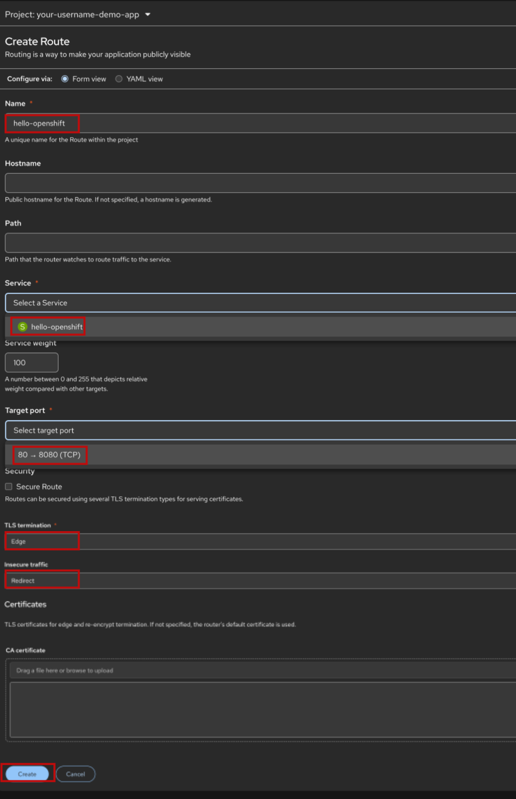

---

**Step 6 — Access the application**

Once the Route is created, click the URL shown in the **Location** column to open the app in your browser.

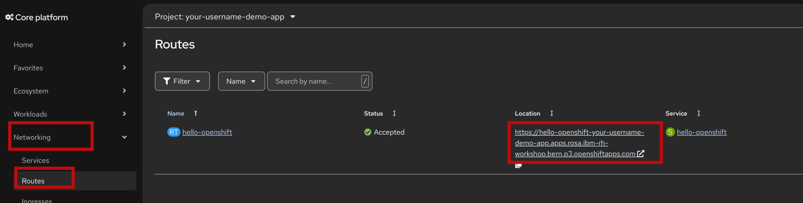

> 🔒 HTTP requests are automatically redirected to HTTPS.

**Clean up** when you are done:

Navigate to **Home → Projects**, find `<username>-demo-app`, click the three-dot menu and select **Delete Project**.


## 4. Access the application

Get the Route URL and open it in your browser:

```bash
oc get route hello-openshift -n <username>-demo-app
```

The app will be available at:

```
https://hello-openshift-<username>-demo-app.apps.<cluster-domain>
```

> 🔒 HTTP requests are automatically redirected to HTTPS.

