# Lab 00 - OpenShift AI Setup

This lab gets your OpenShift AI environment ready for the Day 3 GenAI labs. You will log in to the OpenShift console, navigate to the OpenShift AI dashboard, create a project with its own namespace, launch a Jupyter notebook workbench, and enable developer feature flags to unlock the Gen AI Studio. This must be completed before running any other Day 3 labs.

## Learning Outcomes

- Access and navigate the OpenShift AI dashboard from the OpenShift console
- Launch and configure a Jupyter notebook workbench for running AI workloads
- Enable developer feature flags to access pre-release GenAI features

## Prerequisites

- OpenShift console credentials provided by your instructor

## Steps

### Step 1 - Access the OpenShift Console

1.1. Open the OpenShift console at:

```
https://console-openshift-console.apps.rosa.ibm-rh-workshop.bern.p3.openshiftapps.com/
```

1.2. Click **htpasswd** as the login method.

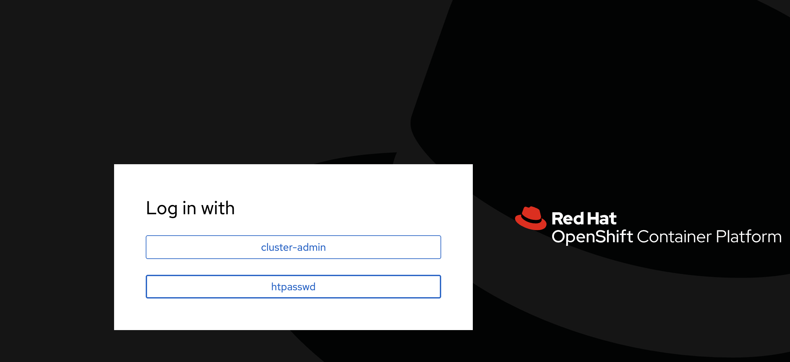

1.3. Enter the username and password provided by your instructor and click **Log in**.

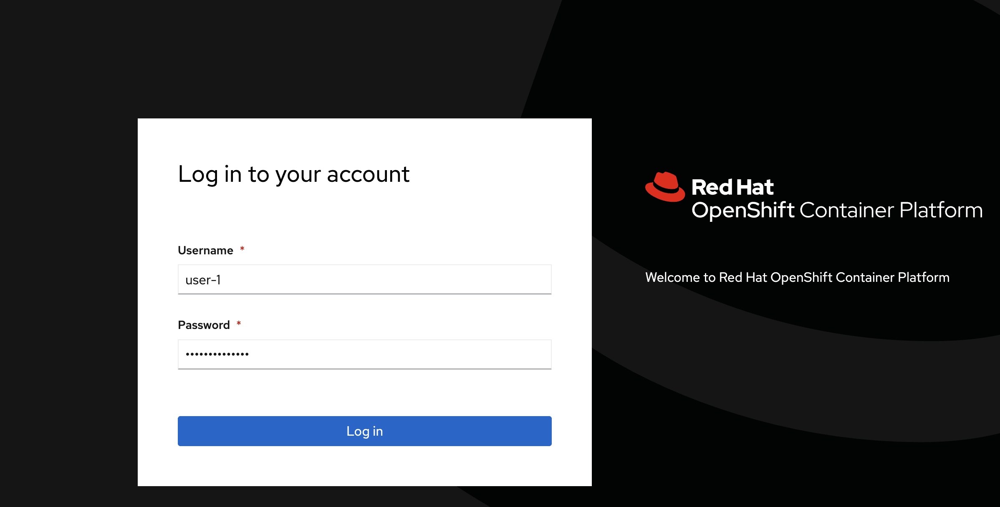

### Step 2 - Navigate to OpenShift AI

OpenShift AI is a separate dashboard that sits alongside the OpenShift console. It provides a managed environment for your AI projects.

2.1. From the OpenShift console, click the grid icon in the top-right corner and select **Red Hat OpenShift AI**.

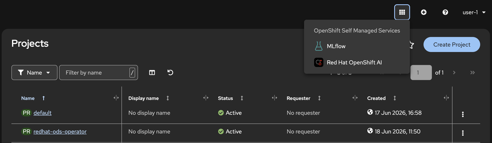

### Step 3 - Create a Project

An OpenShift AI project is a logical grouping for your workbenches, models, and pipelines. Creating one also provisions a dedicated namespace on the cluster, keeping your resources isolated from other namespaces.

3.1. Click on **Create a project**.

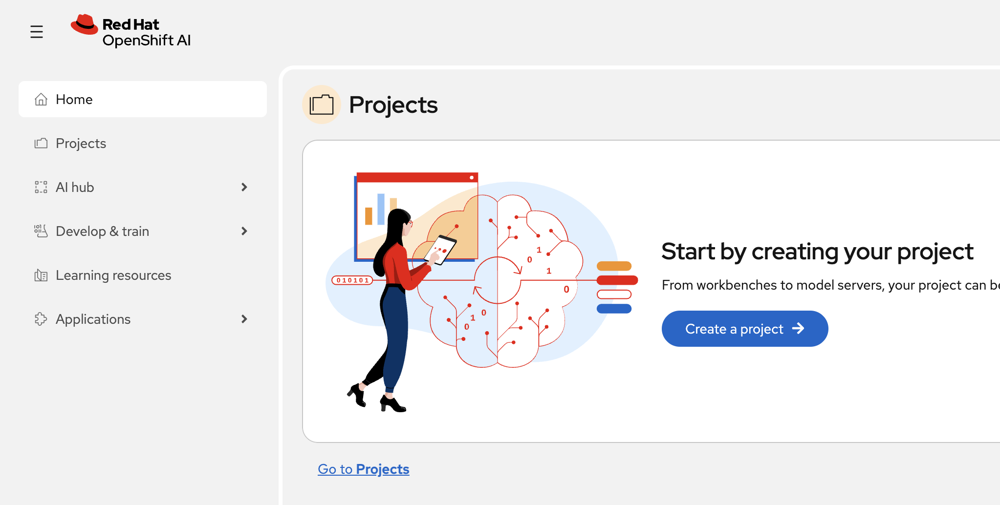

3.2. Give your project a name and click **Create**. This will create a project in the OpenShift AI dashboard and a corresponding namespace with the same name on the cluster.

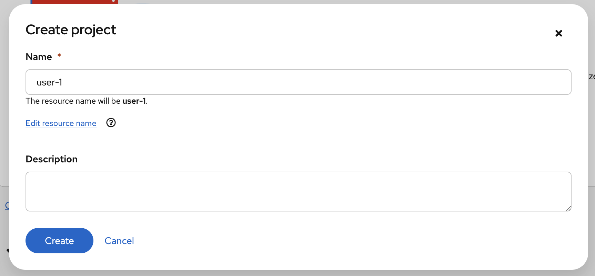

### Step 4 - Launch a Workbench

A workbench is a containerised Jupyter notebook environment that runs directly on the cluster. This is where you will write and execute code for the remaining labs.

4.1. Inside your project, click **Create a workbench**.

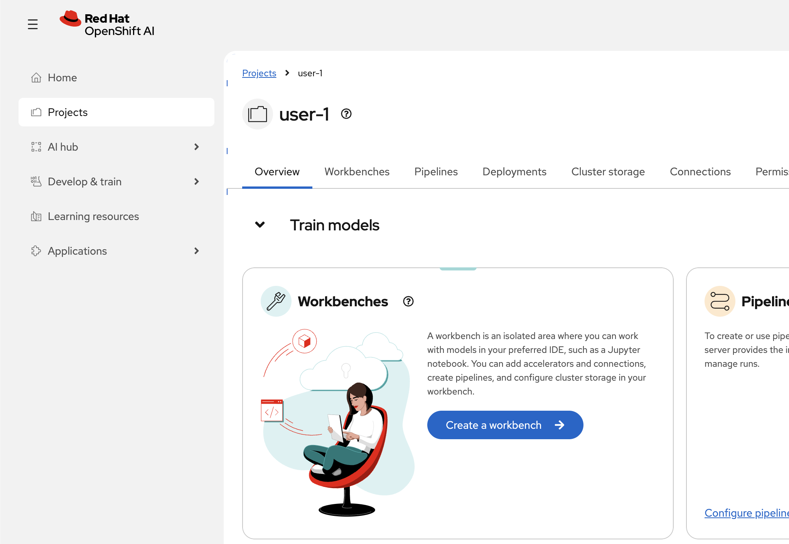

4.2. Configure the workbench with the following settings:

- **Name:** `<name-for-your-workbench>`
- **Image selection:** Jupyter | Minimal | CPU | Python 3.12
- **Version selection:** 2025.2

Leave all other settings as default.

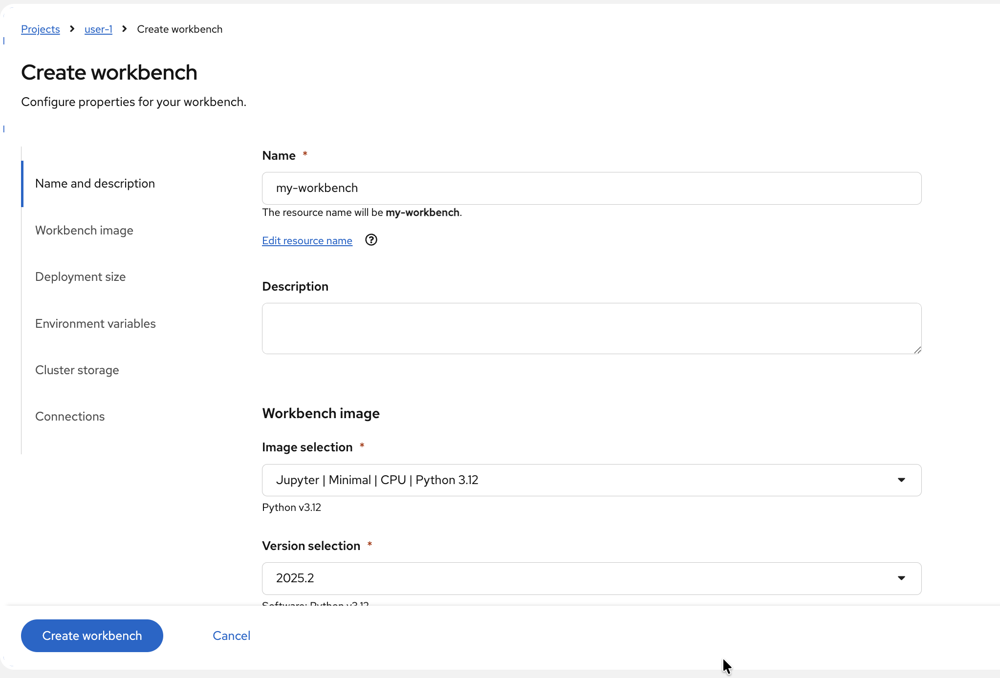

4.3. Click **Create workbench**.

4.4. Wait for the workbench status to show as **Ready**. Click on the workbench name to launch the Jupyter environment and verify it opens correctly. We will be using this workbench in the later labs.

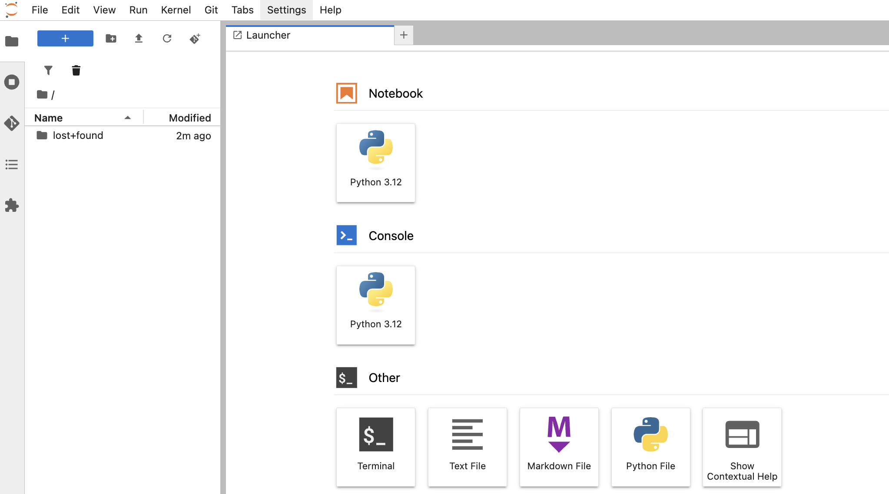

### Step 5 - Enable Developer Feature Flags

Some of the GenAI features we will use in the later labs are not yet Generally Available. Developer feature flags allow us to enable these pre-release capabilities in the dashboard for our session.

5.1. In the OpenShift AI dashboard, click **Home** on the left-hand side bar to return to the home page.

5.2. In your browser's URL bar, append `?devFeatureFlags` to the end of the URL and press **Enter**:

```
https://rh-ai.apps.rosa.ibm-rh-workshop.bern.p3.openshiftapps.com/?devFeatureFlags
```

This enables developer feature flags that give access to features not yet Generally Available, which we will be using in the later labs.

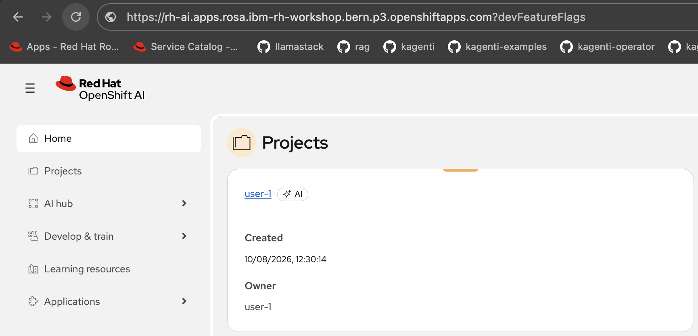

5.3. Click on the **overridden** link that appears in the banner at the top of the page to open the feature flags panel.

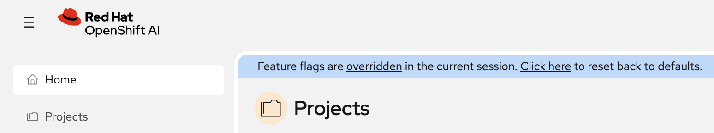

5.4. Tick the following feature flags:

- **aiAssetCustomEndpoints**
- **genAiStudio**

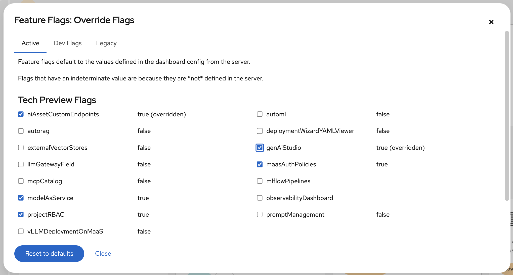

5.5. Close the feature flags window.

5.6. Verify that **Gen AI Studio** now appears in the left-hand side bar.

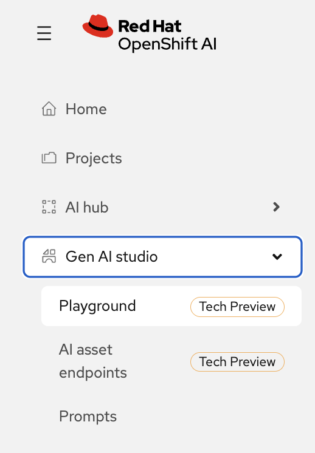

## Next Steps

Congratulations! Your OpenShift AI environment is fully set up and ready to go. You now have a project, a workbench, and the developer features enabled — everything you need to start building with GenAI.

Proceed to the following labs in order:

- [Lab 01 - GenAI Playground & RAG](../../01-genai-playground-rag/lab/README.md)
- [Lab 02 - PDF Ingestion RAG](../../02-pdf-ingestion-rag/lab/README.md)
- [Lab 03 - Red Bank Financial RAG](../../03-redbank-financial-rag/lab/README.md)
