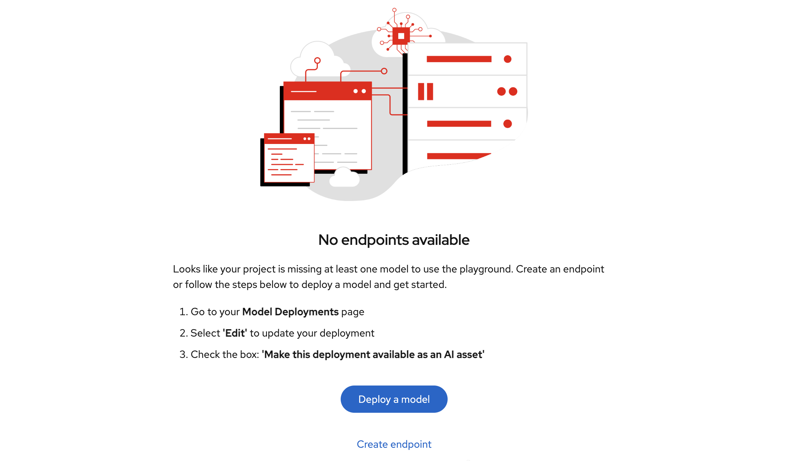
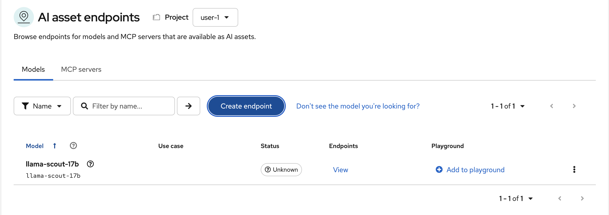
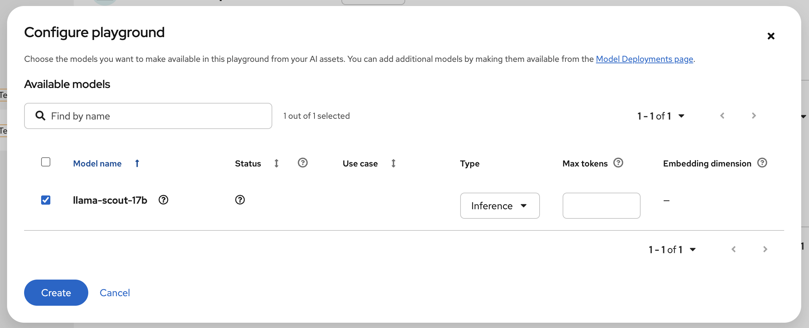
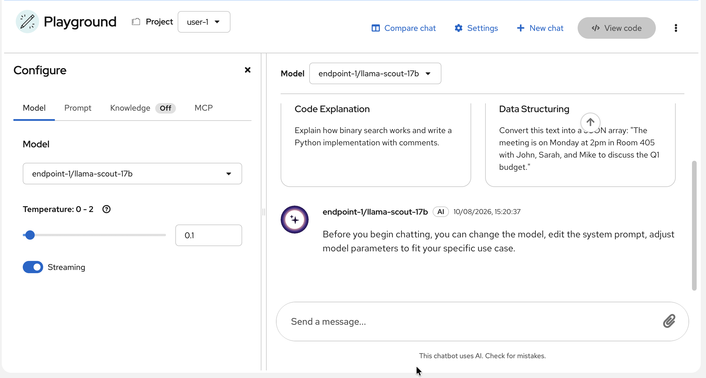
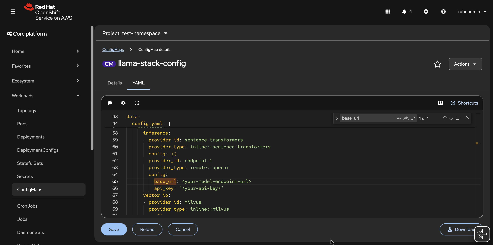
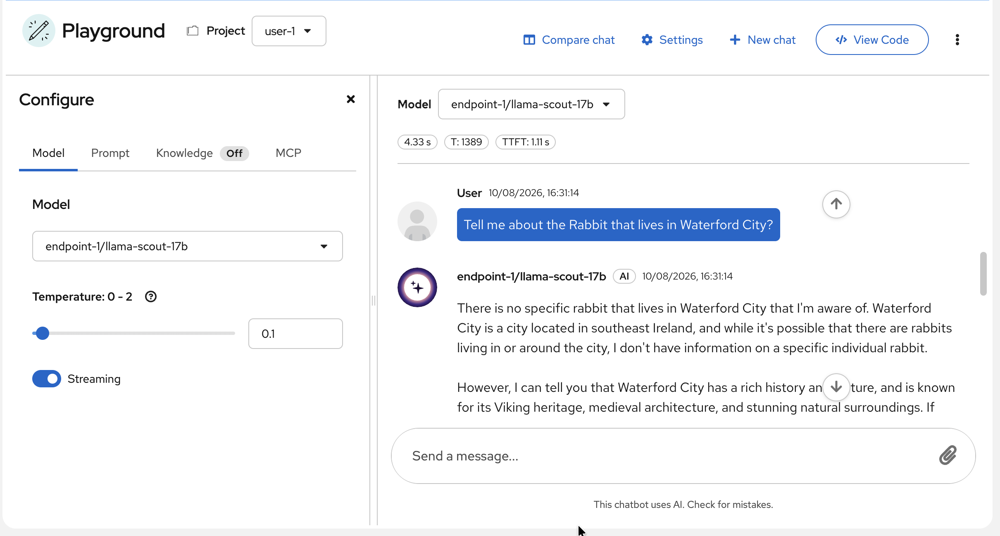
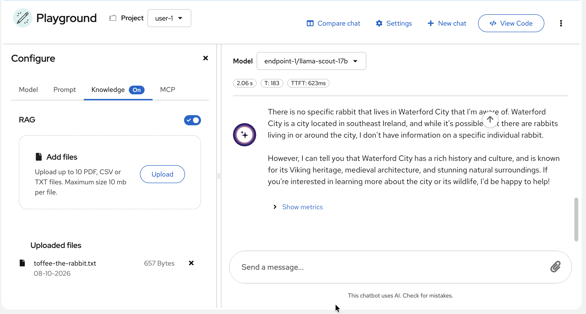
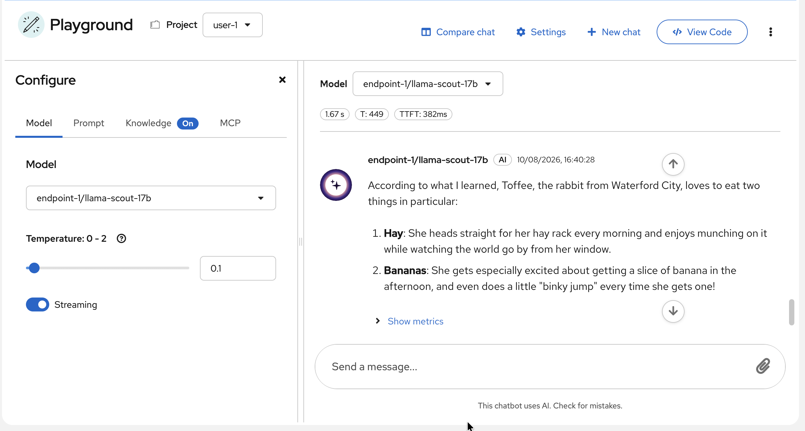

# Lab 01 - GenAI Playground & RAG

This lab walks you through using the Gen AI Studio in OpenShift AI to connect a remotely hosted large language model (Model as a Service), register it as an AI asset endpoint, and launch a GenAI playground. The playground is backed by a LlamaStack distribution that pairs your remote model with a Granite embedding model. You will prompt the model, enable RAG, upload a document about a fictional rabbit named Toffee, and observe how the model goes from knowing nothing to providing accurate answers — all through the UI without writing any code.

## Learning Outcomes

- Register a remote Model as a Service (MaaS) endpoint in OpenShift AI
- Understand what a LlamaStack distribution is and how it connects your model with an embedding model
- Launch and interact with a GenAI playground through the UI
- Enable RAG, upload a document, and observe context-aware responses
- Understand how RAG ingestion works under the hood: chunking, embedding, and vector storage

## Prerequisites

- [Lab 00 - OpenShift AI Setup](../../00-openshift-ai-setup/lab/README.md) completed (including developer feature flags enabled)
- Remote model endpoint URL and API key (provided by your instructor)

## Steps

### Step 1 - Open Gen AI Studio

We need to register a model endpoint before we can use the playground, so we will start by setting one up.

1.1. In the OpenShift AI dashboard, click **Gen AI Studio** on the left-hand side bar.

1.2. Click on the dropdown and select **AI asset endpoints**.

1.3. Change the project to your previously created project name.

1.4. Click **Create endpoint**.



### Step 2 - Add a Remote Model Endpoint

The model we will use is hosted remotely as a Model as a Service (MaaS). Instead of deploying a model on the cluster, we provide the endpoint URL and API key to connect to it.

2.1. Fill in the endpoint form with the following settings:

- **Model type:** Inferencing model
- **Model ID:** `llama-scout-17b`
- **Display name:** `llama-scout-17b`
- **URL:** `https://maas-rhdp.apps.maas.redhatworkshops.io/v1`
- **Token:** `<API key>` (provided by instructor)

2.2. Click **Verify model** to check that the endpoint is reachable and the model exists.

2.3. Once verification passes, click **Create**.

2.4. You should now see your model listed in the AI asset endpoints page.



### Step 3 - Launch the Playground

When you launch a playground, OpenShift AI spins up a LlamaStack distribution behind the scenes. This is essentially a LlamaStack server configured with our remote generative AI model and a default Granite embedding model for RAG.

3.1. On the AI asset endpoints page, click **Add to playground** next to your model.

3.2. Click **Create** to launch the playground. This will start the LlamaStack distribution and connect it to your model.



3.3. Once the playground has been created, you will be redirected to the GenAI Playground. You will find it is already configured with your model.



### Step 4 - Add the API Key to the ConfigMap

When the playground was created, it generated a ConfigMap named `llama-stack-config` in your project namespace. A ConfigMap is a Kubernetes resource used to store configuration data as key-value pairs, which pods can then consume at runtime. In this case, it holds the LlamaStack server configuration including your model's endpoint URL. We need to manually add the API key to this ConfigMap as it is not yet done automatically for us.

4.1. Go back to the OpenShift console.

4.2. Navigate to **Workloads** > **ConfigMaps** in the left-hand side bar.

4.3. Make sure you are viewing your project namespace.

4.4. Click on the `llama-stack-config` ConfigMap.

4.5. Click on the **YAML** tab.

4.6. Locate the `base_url` field that contains your model's URL endpoint. Directly underneath it, add the following field:

```yaml
api_key: <API key provided by instructor (same token used for the llama-scout-17b model)>
```



4.7. Click **Save**.

### Step 5 - Prompt the Model Without RAG

We will first ask the model a question it cannot possibly answer from its training data alone. This establishes a baseline so we can clearly see the difference once RAG is enabled.

5.1. In the playground chat, ask the model the following question:

```
Tell me about the Rabbit that lives in Waterford City?
```

5.2. Observe that the model does not know the answer. This is expected — there is no rabbit from Waterford City in its training data, so it has nothing to draw from.



### Step 6 - Enable RAG and Upload a Document

RAG allows the model to reference external documents when generating responses. When you upload a document, the following happens under the hood:

1. The file is split into smaller text chunks
2. Each chunk is passed through the Granite embedding model to generate a vector representation
3. The vectors are stored in a vector database, indexed by similarity

This means the model can now retrieve relevant chunks based on your question and use them as context when generating a response.

6.1. Click on the **Knowledge** tab in the playground.

6.2. Toggle **RAG** to enable it.

6.3. Upload the `toffee-the-rabbit.txt` file provided in this lab folder. Leave all settings as default.

6.4. Click **Upload**. Wait for the document to be ingested and indexed.



### Step 7 - Prompt the Model With RAG

Now that the document has been ingested, the model can retrieve relevant chunks and use them as context. Let's ask the same question again to see the difference.

7.1. Ask the same question again:

```
Tell me about the Rabbit that lives in Waterford City?
```

7.2. Observe that the model now knows about Toffee — her name, age, favourite foods, and where she lives. The model retrieved the relevant chunks from the uploaded document and used them as context to generate an accurate response.

7.3. Try asking additional questions about Toffee to see how the model retrieves different chunks depending on the query (e.g. "What does Toffee like to eat?" or "How old is Toffee?").



### Step 8 - Experiment (Optional)

8.1. Try different questions to test the boundaries of what the model can retrieve.

8.2. Upload additional documents and observe how the model handles context from multiple sources. The GenAI Playground supports **PDF**, **CSV**, and **TXT** files.

8.3. Try changing the system instructions in the playground (under the **Instructions** tab) to see how it affects the agent's behaviour. For example, instruct it to respond in a different language, keep answers under one sentence, or adopt a specific persona like a pirate or a formal banker.

> **Note:** The file type support is a limitation of the UI. In Lab 02, we will build a similar RAG pipeline programmatically in a Jupyter notebook, where you have full control over which file types to support. To keep things simple, we will use PDF in that lab, but it is possible to extend it to support images, audio, and more.

## Next Steps

Now that you have seen RAG working through the UI, proceed to the next lab where you will build the same pipeline programmatically in a Jupyter notebook:

- [Lab 02 - PDF Ingestion RAG](../../02-pdf-ingestion-rag/lab/README.md)
