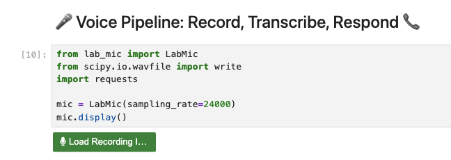

# Lab 03 - Red Bank Financial RAG (End-to-End)

You have been hired to build an AI-powered customer support solution for Red Bank Financial — a fictional bank struggling with long queue times, limited 24/7 availability, and slow resolution times. Your task is to create a voice-enabled RAG agent that can handle customer enquiries by drawing on the bank's "About" page and FAQ documentation, simulating a real phone call experience using Speech-to-Text and Text-to-Speech models.

In this lab, you will connect to the same LlamaStack distribution from previous labs, ingest Red Bank Financial's knowledge base, and build an intelligent agent that customers can speak to naturally. The pipeline uses a Whisper STT (Speech-To-Text) model to transcribe your voice, a RAG-powered agent to generate accurate answers from the knowledge base, and a TTS (Text-To-Speech) model to speak the response back — just like a real automated phone line, but powered by AI.

## Learning Outcomes

- Understand how AI can solve real business problems such as long queue times and limited availability
- Ingest multiple documents into a vector database to build a domain-specific knowledge base
- Build a RAG agent with custom system instructions tailored for customer support
- Record audio input using browser-based microphone capture in a Jupyter notebook
- Transcribe speech to text using a remotely hosted Whisper model
- Convert text responses to speech using a free TTS API
- Combine STT, RAG, and TTS into a complete voice-in, voice-out pipeline

## Prerequisites

- [Lab 00 - OpenShift AI Setup](../../00-openshift-ai-setup/lab/README.md) completed
- [Lab 01 - GenAI Playground & RAG](../../01-genai-playground-rag/lab/README.md) completed
- Familiarity with the concepts from Lab 02
- Whisper STT model endpoint URL and API key (provided by your instructor)

## Architecture

```
🎙️ Microphone → Whisper STT → LLM + RAG → TTS → 🔊 Speaker
```

## Steps

### Step 1 - Create a New Notebook

1.1. Open your Jupyter workbench (created in Lab 00).

1.2. Create a new Python 3 notebook.

1.3. Give it a name (e.g. `red-bank-financial-rag`).

### Step 2 - Install Dependencies

We need a few additional libraries for this lab: `lab-mic` for browser-based audio recording, and `sounddevice`/`scipy` for audio processing. We'll install them in the next steps.

2.1. In the first cell, enter and run:

```python
%pip install llama_stack==0.7.2
%pip install llama_stack_client==0.7.2
%pip install sounddevice
%pip install lab-mic
```

> **Tip:** For each new cell you add, consider adding a **Markdown cell** above it with a short title (e.g. `## Install Dependencies`, `## Voice Pipeline`). This makes your notebook easier to read and navigate. To add a Markdown cell, click the **+** button and change the cell type from "Code" to "Markdown" in the dropdown.

2.2. Click **Kernel** > **Restart Kernel and Clear Outputs of All Cells** for the libraries to take effect.

### Step 3 - List Available Models

3.1. In a new cell, enter and run:

```python
from llama_stack_client import LlamaStackClient

client = LlamaStackClient(base_url="http://lsd-genai-playground-service.<your-namespace>:8321")
client.models.list()
```

Replace `<your-namespace>` with your project namespace name

Expected output:

```
[Model(identifier='endpoint-1/llama-scout-17b', ..., model_type='llm', ...),
 Model(identifier='sentence-transformers/ibm-granite/granite-embedding-125m-english', ..., model_type='embedding', ...)]
```

### Step 4 - Set the LLM and Embedding Model

4.1. In a new cell, enter and run:

```python
from llama_stack_client import LlamaStackClient

client = LlamaStackClient(base_url="http://<service-name>.<your-namespace>:8321")

models = client.models.list()

# Set the generative AI model (LLM) for chat responses
model_id = "<your-ai-model-id>"

# Automatically find the first embedding model and extract its config
embedding_model_id = (
    em := next(m for m in models if m.model_type == "embedding")
).identifier
embedding_dimension = em.metadata["embedding_dimension"]

print(model_id)
print(embedding_model_id)
```

Expected output:

```
endpoint-1/llama-scout-17b
sentence-transformers/ibm-granite/granite-embedding-125m-english
```

### Step 5 - Ask the LLM About Red Bank Financial (Without RAG)

Let's verify that the model has no knowledge of Red Bank Financial — it's a fictional company that doesn't exist in its training data.

5.1. In a new cell, enter and run:

```python
from llama_stack_client import Agent, AgentEventLogger, LlamaStackClient

# Create a basic agent with no RAG tools
agent = Agent(
    client,
    model=model_id,
    instructions="""
    You are a helpful assistant.
    Answer questions briefly and to the best of your knowledge.
    """,
)

prompt = "Who founded Red Bank Financial?"
print("prompt>", prompt)

# Create a turn (a single conversation exchange) and stream the response
response = agent.create_turn(
    messages=[{"role": "user", "content": prompt}],
    session_id=agent.create_session("rag_session_0"),
    stream=True,
)

# Print each token as it arrives from the model
for log in AgentEventLogger().log(response):
    print(log, end="", flush=True)
```

5.2. Observe that the model does not know the answer — Red Bank Financial is fictional and not in its training data.

Expected output:

```
prompt> Who founded Red Bank Financial?
I don't have specific information about who founded Red Bank Financial...
```

### Step 6 - Ingest the Red Bank Financial Knowledge Base

Now we will download and ingest Red Bank Financial's documents — an "About" page and an FAQ — into the vector database. This is the same ingestion pattern from Lab 02, but with multiple documents.

6.1. In a new cell, enter and run:

```python
import io
from llama_stack_client import Agent, AgentEventLogger, LlamaStackClient
import requests

vector_db_name = "redbank_knowledge_base"
client = LlamaStackClient(base_url="http://<service-name>.<your-namespace>:8321")

# Red Bank Financial knowledge base documents (feel free to have a look at the contents of the PDFs)
sources = [
    "https://raw.githubusercontent.com/ChristianZaccaria/redbank-kb/main/redbankfinancial_about.pdf",
    "https://raw.githubusercontent.com/ChristianZaccaria/redbank-kb/main/redbankfinancial_faq.pdf"
]

# Download each PDF and upload to LlamaStack file storage
file_ids = []
for source in sources:
    print("Downloading and uploading document:", source)
    response = requests.get(source)
    # Wrap raw bytes in a BytesIO object so it behaves like a file
    file_content = io.BytesIO(response.content)
    filename = source.split("/")[-1]

    # Upload to LlamaStack's internal storage (purpose="assistants" marks it for agent use)
    file = client.files.create(
        file=(filename, file_content, "application/pdf"),
        purpose="assistants"
    )
    file_ids.append(file.id)
    print(f"✓ Uploaded {filename} (file_id: {file.id})")

# Create a vector store: chunks the docs, generates embeddings, and indexes them in Milvus
vector_store = client.vector_stores.create(
    name=vector_db_name,
    file_ids=file_ids,
    chunking_strategy={
        "type": "static",
        "static": {
            "max_chunk_size_tokens": 512,   # Max tokens per chunk
            "chunk_overlap_tokens": 128     # Overlap between chunks to preserve context at boundaries
        }
    },
    extra_body={
        "embedding_model": embedding_model_id,
        "embedding_dimension": embedding_dimension,
        "provider_id": "milvus"             # Vector database backend
    }
)
print("Created vector store with ID:", vector_store.id)
```

Expected output:

```
Downloading and uploading document: https://raw.githubusercontent.com/.../redbankfinancial_about.pdf
✓ Uploaded redbankfinancial_about.pdf (file_id: ...)
Downloading and uploading document: https://raw.githubusercontent.com/.../redbankfinancial_faq.pdf
✓ Uploaded redbankfinancial_faq.pdf (file_id: ...)
Created vector store with ID: redbank_knowledge_base
```

### Step 7 - Define the Red Bank Financial Agent

This agent has custom system instructions tailored for a customer-facing banking assistant. It uses the `file_search` tool to retrieve relevant information from the knowledge base before responding.

7.1. In a new cell, enter and run (no output is expected as we are only defining the agent):

```python
def run_agent(text: str | None = None):
    # Create an agent with domain-specific instructions for Red Bank Financial
    agent = Agent(
        client,
        model=model_id,
        instructions="""
        You are a helpful, concise Red Bank Financial assistant who answer questions briefly by using the file_search tool.
        - All questions are from customers of Red Bank Financial.
        - Do not show your reasoning steps.
        - You are answering questions to the customer directly.
        - Use the file_search tool to answer all questions in relation to banks, a bank, and red bank financial bank.
        - If the user asks to speak to a real agent, use the file_search tool to retrieve the relevant information on our best agents and provide it to the user briefly."
        - Do not add any filler, speculation, or statements such as "based on the information provided" or "unfortunately...".
        - DO NOT include say "This is a fact" or "For more FAQs", or any file references.
        - DO NOT mention source files or document references in your response.
        - End your response right after the relevant steps or answer.
        """,
        tools=[
            {
                "type": "file_search",
                "vector_store_ids": [vector_store.id]  # Search Red Bank's knowledge base
            }
        ],
    )

    if text is not None:
        # Prefix helps the model understand context — this is a customer query
        prompt = "Red Bank Financial Customer> " + text
        print(prompt)

    # stream=False so we get the complete response text to pass to TTS
    response = agent.create_turn(
        messages=[{"role": "user", "content": prompt}],
        session_id=agent.create_session("rag_session"),
        stream=False,
    )
    final_text = response.output_text

    print("response>", final_text)
    return final_text
```

### Step 8 - Record Audio via Microphone

This cell displays a browser-based microphone recording widget. Since the notebook runs on a remote server with no physical microphone, `lab-mic` uses your browser's microphone via JavaScript and sends the audio data back to the Python kernel.

8.1. In a new cell, enter and run:

```python
from lab_mic import LabMic
from scipy.io.wavfile import write
import requests

# 24000 Hz sample rate — standard for speech audio
mic = LabMic(sampling_rate=24000)
mic.display()
```

8.2. Click **Record**, speak your question about Red Bank Financial, then click **Stop**. Suggested questions: "Who founded Red Bank Financial?" or "How can I transfer money to another account?"



> **Note:** If the recording widget does not appear, save your notebook (or you might lose your changes), then try refreshing the page.

8.3. In a new cell, enter and run the following to save the recorded audio to a WAV file:

```python
filename="input.wav"

audio_data = mic.get_result()
write(filename, 24000, audio_data)
time.sleep(15)
print(f"✅ Audio saved: {filename}")
```

### Step 9 - Run the Voice Pipeline: STT, Agent, and TTS

This cell ties everything together. It transcribes the recording using the Whisper STT model, passes the transcribed text to the RAG agent, and converts the agent's response to speech using a free TTS API.

9.1. In a new cell, enter and run:

```python
from scipy.io.wavfile import write
from lab_mic import LabMic
import requests
from llama_stack_client import LlamaStackClient
import numpy as np
import queue
import time
from IPython.display import Audio, display

# Remote model endpoints
WHISPER_URL = "<whisper-endpoint-url>"
WHISPER_API_KEY = "<whisper-api-key>"
TTS_URL = "https://api.tts.ai/v1/tts/"
LLAMASTACK_URL = "http://lsd-genai-playground-service.<your-namespace>:8321" # Replace <your-namespace> with your project namespace name

client = LlamaStackClient(base_url=LLAMASTACK_URL)

def transcribe_audio(filename):
    """Send audio to the Whisper STT model and return the transcribed text."""
    with open(filename, "rb") as f:
        res = requests.post(
            WHISPER_URL,
            headers={"Authorization": f"Bearer {WHISPER_API_KEY}"},
            files={"file": (filename, f, "audio/wav")},
            data={"model": "whisper-small"},
        )
    res.raise_for_status()
    text = res.json().get("text", "").strip()
    return text

def speak_response(text):
    print(f"🔊 Sending to TTS: {text[:50]}...")
    res = requests.post(
        TTS_URL,
        json={
            "text": text,
            "voice": "af_heart",
            "model": "kokoro",
            "format": "mp3",
            "speed": 1.0,
        },
    )
    if res.status_code != 200:
        print(f"TTS Error: {res.text}")
        return

    data = res.json()
    result_url = data.get("result_url")

    # API is async: cached requests return result_url immediately,
    # new requests return a uuid and queue the job on the CDN
    if not result_url:
        uuid = data.get("uuid")
        cdn_url = f"https://cdn.tts.ai/{uuid}/tts_output.mp3"
        for _ in range(15):
            time.sleep(3)
            audio_res = requests.get(cdn_url)
            if audio_res.status_code == 200:
                display(Audio(data=audio_res.content, autoplay=True))
                return
        print("TTS timed out")
        return

    audio_res = requests.get(result_url)
    audio_res.raise_for_status()
    print("✅ Audio ready")
    display(Audio(data=audio_res.content, autoplay=True))
    
if __name__ == "__main__":
    prompt = transcribe_audio(filename)
    if prompt:
        agent_reply = run_agent(prompt)
        speak_response(agent_reply)
```

Replace `<whisper-endpoint-url>`, `<whisper-api-key>` with the values provided by your instructor.

9.2. After running the cell, you should see:
- The transcription of your question
- The agent's response retrieved from the knowledge base
- An audio player with the spoken response

Expected output (example with the question "Who founded Red Bank Financial?"):

```
Red Bank Financial Customer> Who founded Red Bank Financial?
response> Red Bank Financial was founded in 2025...
🔊 Sending to TTS: Red Bank Financial was founded in 2025...
```

An audio player widget will appear below.

### Step 10 - Ask More Questions

To ask another question, go back to Step 8, record a new question, then run Step 9 again.

10.1. Try questions like:
- "Who founded Red Bank Financial?"
- "What services does Red Bank offer?"
- "Can I speak to a real agent?"
- "What are your opening hours?"

### Step 11 - Experiment

11.1. Try changing the TTS voice — other free options on the `kokoro` model include `am_adam` (male), `bf_emma` (British female), or `bm_george` (British male).

11.2. Adjust the `speed` parameter (e.g. `1.2` for faster, `0.8` for slower).

11.3. Try ingesting additional documents into the knowledge base and asking questions that span multiple sources.

## Next Steps

Congratulations! You have built a complete voice-enabled RAG assistant that combines Speech-to-Text, a knowledge-grounded LLM agent, and Text-to-Speech into a single pipeline.

The opportunities from here are endless. This agent could be extended to connect to an external PostgreSQL database containing customer account data — allowing customers to check their balance, view recent transactions, or even initiate money transfers, all through voice. Instead of waiting on hold for a human agent, customers could resolve common banking tasks instantly through this AI-powered phone line.

While this lab runs in a Jupyter notebook for learning purposes, in a production environment on OpenShift you would containerise this pipeline and expose it as a REST API endpoint. That endpoint could then be integrated with telephony systems, mobile apps, or web chat interfaces — making it accessible to thousands of customers simultaneously, with OpenShift handling the scaling and availability automatically.
