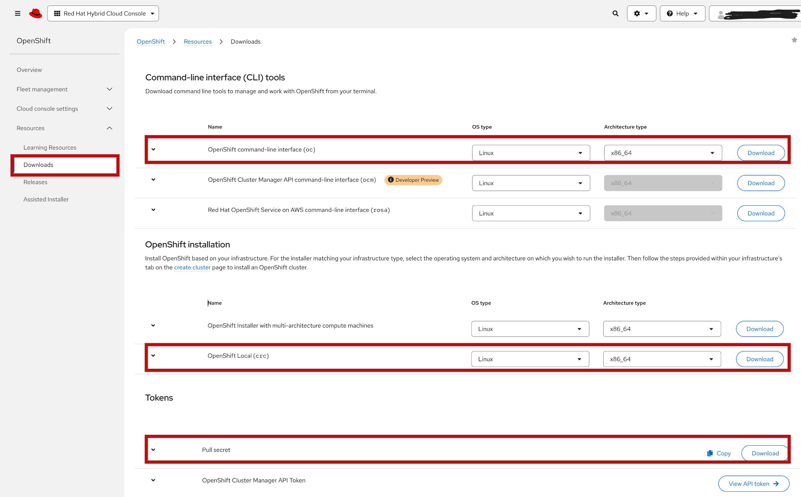

# Pre-Setup Guide: Installing OC and CRC

This guide covers the installation of OC and CRC on  **Fedora Linux** before the workshop begins.

---

## Table of Contents

- [System Requirements](#system-requirements)
- [Installing on Fedora](#installing-on-fedora)
- [Post-Installation: Verify the Installation](#post-installation-verify-the-installation)
- [Configure CRC](#configure-crc)
- [Troubleshooting](#troubleshooting)

---

## System Requirements
| Component | Minimum Requirement |
|-----------|---------------------|
| CPUs | 8 physical CPU cores |
| Memory | 15 GB of free memory |
| Storage | 80 GB of available storage |

<br>

---


## Operating system requirements

CRC requires the following minimum version of a supported operating system:

### Linux - Fedora
- Latest two stable releases.
- libvirt and NetworkManager packages are installed.

```bash
sudo dnf install libvirt NetworkManager
```

### macOS
- macOS 13 Ventura or later.
- CRC does not work on earlier macOS versions.

## Installing on Fedora
Go to https://console.redhat.com/openshift/downloads and download these three things
(a free Red Hat account is required):

- OpenShift command-line interface (oc) — the CLI for managing OpenShift.
- OpenShift Local (crc) — the single-node OpenShift cluster that runs on your laptop.
- Pull secret — the credential that allows CRC to pull Red Hat images.

Keep the pull secret somewhere accessible. You will need it when you start CRC for the first time.

<br>



<br>

### Install OC
On your terminal, change into your Downloads directory and extract the oc.rhel9.tar file and add it to your path
```bash
cd ~/Downloads
tar -xf oc.rhel9.tar
sudo mv oc.rhel9 /usr/local/bin/oc
sudo chmod +x /usr/local/bin/oc  
```

<br>

### Install CRC
On your terminal, change into your Downloads directory and extract the crc-linux-amd64.tar.xz file and add it to your path
```bash
cd ~/Downloads
tar -xf crc-linux-amd64.tar.xz
sudo mv crc-linux-2.62.0-amd64/crc /usr/local/bin/crc
sudo chmod +x /usr/local/bin/crc  
```

> **Note:** The directory name inside the archive may vary depending on the CRC version you downloaded. If crc-linux-2.62.0-amd64 does not exist, run `ls` to see the extracted directory name and use that name in the `mv` command.

<br>

---

## Post-Installation: Verify the Installation

You can verify the installation by checking the versions of oc and crc
```bash
oc version --client
crc version
```

Take note of the pull secret you downloaded as you will be using it later

<br>

---

## Configure CRC

Once installed we can configure the crc cluster.

```
crc config set disk-size 80
crc config set cpus 8
crc config set memory 15360

# One-time host configuration
crc setup

# Start the local OpenShift cluster (takes a few minutes the first time) you will be prompted for the pull secret you downloaded.
crc start
```

<br>


---

## Troubleshooting
### oc: command not found

Check that /usr/local/bin is in your PATH:
```
echo $PATH
```
If /usr/local/bin is missing, add it to your PATH:
```
export PATH="/usr/local/bin:$PATH"
```
Then try:
```
oc version --client
```
